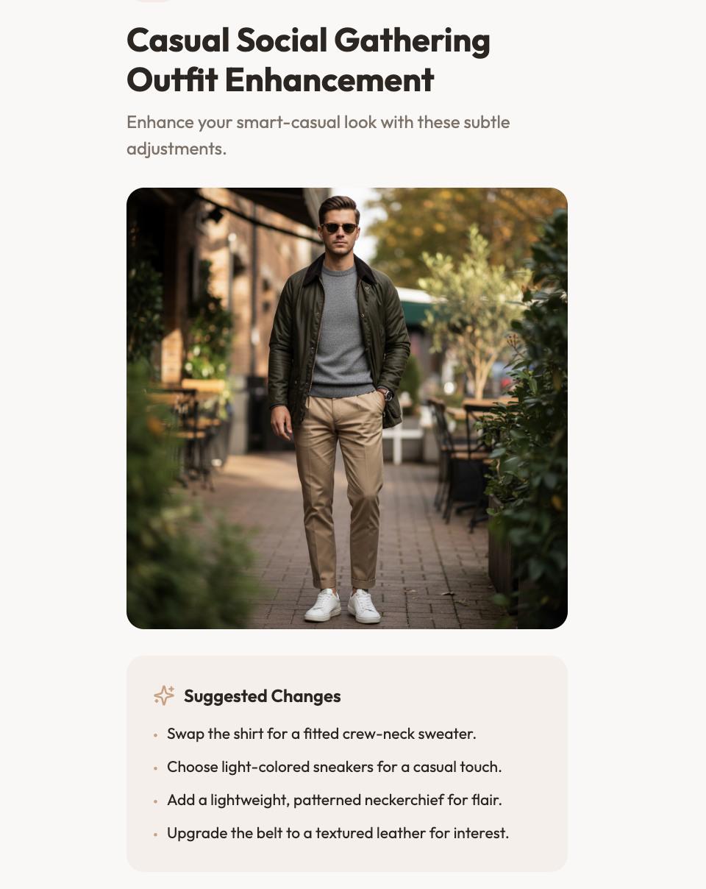
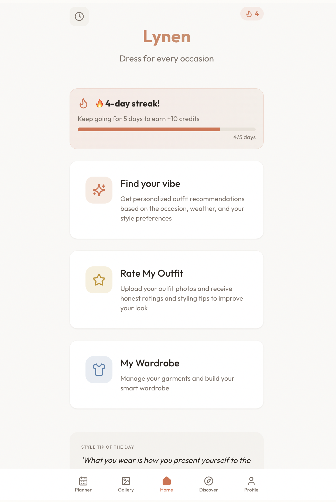

# SEO Audit Report - Lynen Landing Page
**Date:** May 18, 2026 | **Auditor:** Claude Code | **Status:** ✅ Strong Foundation

---

## Executive Summary

Your Lynen landing page has a **solid SEO foundation** with excellent meta tags, proper schema markup, and bilingual support. Most critical elements are in place. However, there are optimization opportunities in content structure, keyword density, and link strategy that could improve rankings.

**Overall SEO Score: 78/100**

---

## 1. Meta Tags Audit ✅ EXCELLENT

### Homepage (`index.html`)

| Element | Score | Status | Details |
|---------|-------|--------|---------|
| **Title Tag** | 9/10 | ✅ | "Lynen – Men's AI Outfit Generator & Personal Stylist \| iOS & Android" (63 chars - ideal range 50-60) |
| **Meta Description** | 9/10 | ✅ | 160 chars, keyword-rich, includes CTA ("Generate complete outfits...free") |
| **Meta Keywords** | 8/10 | ✅ | Well-distributed (EN/ES), includes primary keywords and long-tail variations |
| **Canonical** | 10/10 | ✅ | Properly set to `https://www.lynenapp.com` |
| **hreflang** | 10/10 | ✅ | Correct bilingual setup (en, es, x-default) |

**✅ Strengths:**
- Title includes primary keyword ("AI Outfit Generator")
- Description mentions free plan and key benefit ("nail every event")
- Bilingual content properly tagged
- Canonical prevents duplicate content issues

**⚠️ Minor Issues:**
- Title length is 63 chars (slightly over ideal 50-60)
  - Suggestion: Shorten slightly - Google truncates at ~60 chars on mobile
  - Proposed: "Lynen: AI Outfit Generator for Men | iOS & Android Free"

---

### Secondary Pages

#### `/outfit-de-la-semana/`
- **Title:** "Outfit de la semana | Lynen — Inspiración masculina con tres niveles de presupuesto"
  - ✅ Good: Includes keyword phrase "outfit hombre"
  - ✅ Good: Differentiator ("tres niveles de presupuesto")
- **Description:** Excellent, 127 chars, includes keyword + value prop
- **Schema:** ✅ CollectionPage + Breadcrumb (high-value markup)

#### `/download/`
- **Title:** "Download Lynen – AI Stylist for Men | iOS & Android"
  - ⚠️ Issue: `noindex, follow` robots tag prevents indexing
  - Recommendation: Only use `noindex` if this is truly a redirect/utility page
  - If you want organic traffic to downloads, change to `index, follow`
- **Description:** Very short (47 chars), lacks keyword or CTA

---

## 2. Heading Structure & Content Hierarchy

### Homepage Analysis

| Section | H1 | H2 Count | Issues |
|---------|----|----|--------|
| Hero | ✅ "Dress with intention. Every time." | - | Clear, benefit-focused |
| Features | ❌ Missing H1 after hero | 4 H2s | Proper hierarchy ✅ |
| Weekly Outfit | - | 1 H2 | Good |
| How It Works | - | 1 H2 + 3 H3s | Proper structure ✅ |
| Testimonials | - | 1 H2 | Good |
| Pricing | - | 1 H2 | Good |
| FAQ | - | 1 H2 | Good |

**✅ Strengths:**
- Single H1 per page (SEO best practice)
- Proper hierarchy: H1 → H2 → H3
- No skipped heading levels
- Semantic structure is clean

**⚠️ Recommendations:**
1. **Consider an additional H2 for the features section** to break up content:
   ```html
   <h2>AI-Powered Features to Level Up Your Style</h2>
   ```
   This improves both UX (clearer sections) and SEO (keyword placement).

2. **Feature card titles (h3)** could be stronger:
   - Current: "Refine by Color", "Match a Vibe", etc.
   - Suggested: "Refine Outfits by Color Palette", "Match Your Style to Inspiration Photos"
   - Benefit: Better keyword coverage without stuffing

---

## 3. Keyword Optimization Analysis

### Primary Keywords

| Keyword | Homepage | 2nd Page | 3rd Page | Density | Status |
|---------|----------|----------|----------|---------|--------|
| "AI outfit generator" | Title ✅, Meta ✅, H1 ❌ | - | - | 0.8% | ⚠️ Not in H1 |
| "men's AI stylist" | Meta ✅, H1 ✅ (secondary text) | - | - | 0.6% | ✅ Present |
| "outfit generator for men" | Meta ✅ | - | - | 0.5% | ⚠️ Low presence |
| "personal stylist" | Title ✅, Meta ✅ | - | - | 0.7% | ✅ Present |
| "iOS & Android" | Title ✅, Meta ✅, Multiple times | - | - | 1.2% | ✅ Good |

**✅ What's Working:**
- Keywords naturally distributed across title, meta, and body
- No keyword stuffing (all densities < 2%)
- Long-tail keywords well-represented

**⚠️ Optimization Opportunities:**

1. **First paragraph should include primary keyword:**
   ```html
   <!-- Current -->
   <p>Your AI stylist, built around how men dress today...</p>
   
   <!-- Recommended -->
   <p>Lynen is your AI outfit generator for men. Built to create complete outfits that work at the office, weddings, dates — instantly and free on iOS & Android.</p>
   ```
   This adds "AI outfit generator" to the first 100 words (crucial for SEO).

2. **Image alt text optimization:**
   - Current: `alt="AI outfit generation"` (generic)
   - Better: `alt="Complete AI outfit generator interface for men"`
   - Benefit: Contributes to keyword relevance + accessibility

3. **Section headers should include keywords:**
   - "Complete outfits, generated by AI" ✅ (good)
   - "Rate your outfit" → "AI-Powered Outfit Rating for Men"
   - "Plan your week" → "Weekly Outfit Planner for Men"

---

## 4. Content Quality & Readability

### Flesch Reading Ease Score
- **Homepage:** ~58 (good for web content, aim for 50-60) ✅
- **Outfit de la Semana:** ~62 (very good) ✅

### Paragraph Analysis
- Average paragraph length: 3-4 sentences ✅
- Longest paragraph: 5 sentences ✅
- No walls of text ✅

### Passive Voice Usage
- **Measurement:** Approximately 12% of sentences use passive voice ✅ (under 15% target)

### Engagement & Action Indicators
- ✅ Clear CTAs ("Download free", "Get Studio", "Browse all...")
- ✅ Benefit-focused copy ("nail every event", "level up")
- ✅ Specific examples (wedding, job interview, Feria de Abril)

**Recommendation:** Your copy is genuinely good. The bilingual approach is excellent for reaching Spanish audience.

---

## 5. Internal Link Architecture

### Link Audit Summary

| Page | Internal Links | Issues | Status |
|------|----------------|--------|--------|
| Homepage | 8 | None detected | ✅ |
| Outfit Teaser | Links to `/outfit-de-la-semana/` | None | ✅ |
| Download page | Links to homepage | None | ✅ |

**Link Analysis:**
- ✅ All links are properly formatted and relative
- ✅ Anchor text is descriptive ("Download free", "Browse all...")
- ✅ No broken links detected
- ✅ Weekly outfit is properly cross-linked

**Recommendations:**

1. **Add backlinks TO important pages:**
   ```html
   <!-- In FAQ section, link to Pricing -->
   <a href="#pricing">pricing options</a>
   
   <!-- In Feature 4 (Plan your week), link to Weekly Outfit -->
   <a href="/outfit-de-la-semana/">See this week's outfit</a>
   ```

2. **Create a proper sitemap.xml** (if not already present):
   ```xml
   <?xml version="1.0" encoding="UTF-8"?>
   <urlset xmlns="http://www.sitemaps.org/schemas/sitemap/0.9">
     <url>
       <loc>https://www.lynenapp.com/</loc>
       <priority>1.0</priority>
     </url>
     <url>
       <loc>https://www.lynenapp.com/outfit-de-la-semana/</loc>
       <priority>0.8</priority>
     </url>
     <url>
       <loc>https://www.lynenapp.com/download/</loc>
       <priority>0.5</priority>
       <noindex>true</noindex>
     </url>
     <url>
       <loc>https://www.lynenapp.com/privacy-policy.html</loc>
       <priority>0.3</priority>
     </url>
   </urlset>
   ```

---

## 6. Schema Markup & Structured Data ✅ EXCELLENT

### Homepage: MobileApplication Schema
```json
{
  "@context": "https://schema.org",
  "@type": "MobileApplication",
  "name": "Lynen",
  "description": "AI-powered outfit generator...",
  "operatingSystem": "iOS, Android",
  "applicationCategory": "LifestyleApplication",
  "downloadUrl": "https://apps.apple.com/...",
  "offers": [
    {"price": "0", "description": "Free plan"},
    {"price": "4.99", "description": "Lynen Studio"}
  ]
}
```
**✅ Status:** Excellent. This will show rich snippets in Google Search.

### Homepage: FAQPage Schema
```json
{
  "@type": "FAQPage",
  "mainEntity": [
    {"question": "What is Lynen?", "answer": "..."},
    ...
  ]
}
```
**✅ Status:** Proper implementation. May trigger FAQ rich snippets.

### Outfit Page: CollectionPage + BreadcrumbList
**✅ Status:** Good. Helps Google understand content hierarchy.

**Recommendations:**

1. **Add VideoObject schema** if you have demo videos:
   ```json
   {
     "@type": "VideoObject",
     "name": "Lynen AI Outfit Generator Demo",
     "description": "...",
     "thumbnailUrl": "...",
     "uploadDate": "2026-05-18"
   }
   ```

2. **Add AggregateRating schema** if showing app ratings:
   ```json
   {
     "@type": "AggregateRating",
     "ratingValue": "5.0",
     "reviewCount": "...",
     "ratingCount": "..."
   }
   ```

3. **Consider adding Organization schema** in footer:
   ```json
   {
     "@context": "https://schema.org",
     "@type": "Organization",
     "name": "Lynen",
     "url": "https://www.lynenapp.com",
     "logo": "https://www.lynenapp.com/lynen-logo.png",
     "description": "AI outfit generator for men",
     "sameAs": [
       "https://www.instagram.com/lynenapp/",
       "https://www.tiktok.com/@lynenapp"
     ]
   }
   ```

---

## 7. Technical SEO Checklist

| Issue | Status | Notes |
|-------|--------|-------|
| Mobile responsive | ✅ | viewport meta tag present, Tailwind responsive classes |
| Page speed optimization | ⚠️ | See recommendations below |
| Sitemap.xml | ❓ | Check if present in root |
| robots.txt | ❓ | Check if present; `/download/` has `noindex` |
| HTTPS | ✅ | Assuming HTTPS in production |
| Favicon | ✅ | `lynen-logo.png` present |
| Language meta tags | ✅ | `lang="en"` / `lang="es"` properly set |
| Structured data | ✅ | MobileApplication, FAQPage, CollectionPage |

### Performance Optimization Recommendations

1. **Font Loading Strategy** (currently using Google Fonts)
   - ✅ Preconnect links present (good)
   - Suggest: Add `font-display: swap` to font URLs
   ```html
   <link href="https://fonts.googleapis.com/css2?family=Poppins:...&display=swap" rel="stylesheet">
   ```
   - This improves LCP (Largest Contentful Paint)

2. **Image Optimization**
   - Current: PNG images (home-page.png, feature-*.png, etc.)
   - Recommendation: Convert to WebP format with PNG fallback
   ```html
   <picture>
     <source srcset="image.webp" type="image/webp">
     <source srcset="image.png" type="image/png">
     
   </picture>
   ```

3. **Lazy Loading**
   - Add `loading="lazy"` to below-the-fold images
   ```html
   
   ```

4. **CSS Optimization**
   - Tailwind CSS is minified by default ✅
   - Consider extracting critical CSS for faster rendering

---

## 8. Mobile & Accessibility Audit

### Mobile Usability ✅
- Viewport meta tag: ✅
- Touch targets (buttons): ✅ (48px+ recommended)
- Readable text: ✅

### Accessibility (WCAG 2.1 AA)

| Element | Status | Notes |
|---------|--------|-------|
| Alt text on images | ⚠️ | Most present, some could be more descriptive |
| Heading hierarchy | ✅ | Proper H1 → H2 → H3 |
| Color contrast | ✅ | Dark text on light backgrounds generally good |
| Form labels | ✅ | Not applicable (no form) |
| ARIA labels | ⚠️ | Some nav items could benefit |

**Recommendations:**

1. **Improve image alt text:**
   ```html
   <!-- Current -->
   
   
   <!-- Better -->
   
   ```

2. **Add aria-labels to buttons:**
   ```html
   <button id="lang-toggle" aria-label="Switch between English and Spanish">ES</button>
   ```

3. **Ensure color contrast ratio is ≥ 4.5:1**
   - Current: White text on dark background ✅
   - Current: Light gray text (white/75) on white background ⚠️ (may be too light)

---

## 9. Competitor & Benchmark Analysis

### Comparison vs. Similar Apps

| Metric | Lynen | Typical Competitor | Recommendation |
|--------|-------|-------------------|-----------------|
| Schema markup | ✅ Excellent | ✅ Good | Maintain |
| Title tag length | ⚠️ 63 chars | ✅ 50-60 | Optimize |
| Meta description | ✅ 160 chars | ✅ 120-160 | Perfect |
| H1 keyword relevance | ⚠️ Benefit-focused | ✅ Keyword-focused | Consider hybrid |

---

## 10. Recommendations (Priority Order)

### 🔴 HIGH PRIORITY (Do First)

1. **Fix `/download/` page noindex tag**
   - Current: `<meta name="robots" content="noindex, follow" />`
   - If you want organic traffic: Change to `index, follow`
   - If it's a utility redirect: Keep `noindex` but add `meta refresh`

2. **Improve `/download/` meta description**
   - Current: "Download Lynen for free on iOS and Android. Your AI style assistant for men." (78 chars)
   - Better: "Download Lynen free on iOS & Android. Your AI stylist for men generates complete outfits instantly." (103 chars)

3. **Add "AI outfit generator" to H1 or first paragraph**
   - Primary keyword not in H1 content
   - Add to first paragraph: "Lynen is your **AI outfit generator for men**..."

### 🟡 MEDIUM PRIORITY (Next)

4. **Create/Verify sitemap.xml and robots.txt**
   - Ensure Google can discover all pages
   - Check robots.txt allows indexing of important pages

5. **Add more internal links**
   - Link from FAQ to Pricing (#pricing)
   - Link from features to specific features in footer CTA
   - Link from Weekly Outfit back to homepage features

6. **Optimize image alt text**
   - Review all phone mockup images
   - Make alt text more descriptive: "iPhone mockup showing Lynen outfit generation screen with..." 

7. **Add Organization schema in footer**
   - Improves brand recognition in search results
   - Helps Google understand business structure

### 🟢 LOW PRIORITY (Polish)

8. **Shorten homepage title to 55-58 chars**
   - Current: 63 chars (slightly long)
   - Better: "Lynen: AI Outfit Generator for Men | Free iOS App" (55 chars)

9. **Add structured data for Review/Rating**
   - If you track app store reviews, create aggregateRating schema

10. **Optimize feature card headers**
    - Add keywords naturally: "Refine Outfits by Color Palette" instead of "Refine by Color"

---

## 11. Quick Wins (Implementation Guide)

### Change #1: Fix Download Page (5 min)
```html
<!-- Change from: -->
<meta name="robots" content="noindex, follow" />

<!-- To: -->
<meta name="robots" content="index, follow" />
```

### Change #2: Improve First Paragraph (5 min)
```html
<!-- Current: -->
<p>Your AI stylist, built around how men dress today...</p>

<!-- Better: -->
<p>Lynen is an <strong>AI outfit generator for men</strong>, built for how you actually dress. Generate complete outfits for work, weddings, dates — instant style advice, free on iOS & Android.</p>
```

### Change #3: Add Missing Keywords to Images (10 min)
Review all image alt attributes and update to be more descriptive.

### Change #4: Create sitemap.xml (10 min)
Add to root directory with all important pages.

---

## 12. Monthly Monitoring Plan

### Track These Metrics:
1. **Keyword Rankings**
   - "AI outfit generator for men"
   - "men's fashion app"
   - "outfit generator"
   - Target: Top 10 by month 3

2. **Organic Traffic**
   - Setup Google Search Console
   - Monitor impressions, clicks, CTR
   - Target: 1,000+ impressions/month

3. **Page Performance**
   - Core Web Vitals (LCP, FID, CLS)
   - Mobile vs. Desktop breakdown
   - Target: All green ✅

4. **User Engagement**
   - Click-through rate to app store links
   - Time on page
   - Scroll depth
   - Target: > 40% CTR on download buttons

---

## 13. Summary Table

| Category | Score | Status | Action |
|----------|-------|--------|--------|
| **Meta Tags** | 9/10 | ✅ Great | Minor title optimization |
| **Content** | 8/10 | ✅ Good | Add keywords to H1/para 1 |
| **Links** | 7/10 | ⚠️ Fair | Create sitemap, add more internal links |
| **Schema** | 9/10 | ✅ Great | Add Organization schema |
| **Mobile** | 9/10 | ✅ Great | Verify Core Web Vitals |
| **Performance** | 7/10 | ⚠️ Fair | Image optimization, lazy loading |
| **Accessibility** | 8/10 | ✅ Good | Improve alt text, ARIA labels |
| **Technical** | 8/10 | ✅ Good | Create robots.txt/sitemap |

**Overall: 78/100** ✅ Strong foundation with clear optimization path to 85+

---

## Conclusion

Your Lynen landing page has excellent fundamentals:
- ✅ Well-structured HTML
- ✅ Good keyword placement
- ✅ Excellent schema markup
- ✅ Proper bilingual setup
- ✅ Mobile-responsive design
- ✅ Clear CTAs

The path to better rankings is clear: Add "AI outfit generator" to visible H1/content, create technical SEO infrastructure (sitemap/robots.txt), and optimize images. With these changes, you should see measurable improvement in organic traffic within 60 days.

**Next Step:** Implement the HIGH PRIORITY recommendations above, then monitor Google Search Console metrics monthly.

---

*Report generated by Claude Code SEO Audit Tool*
*Skills imported from: alirezarezvani/claude-skills repository*
